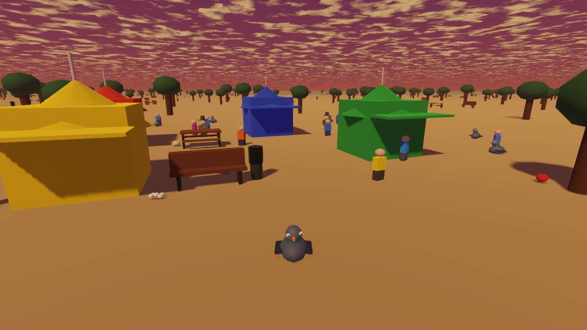
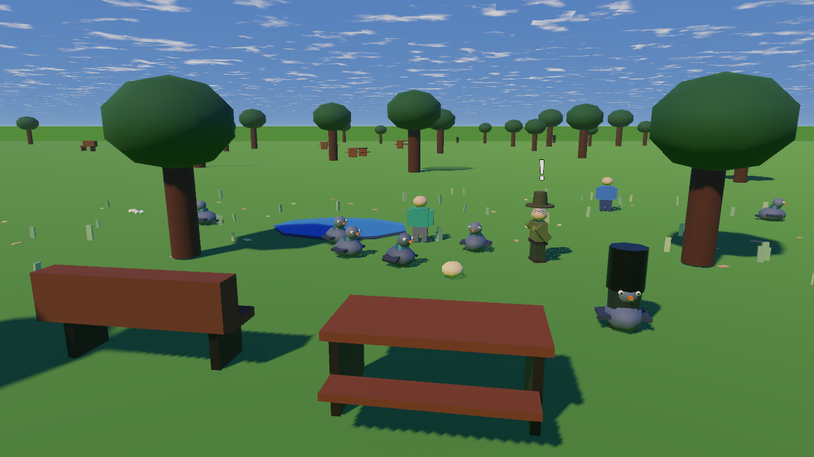
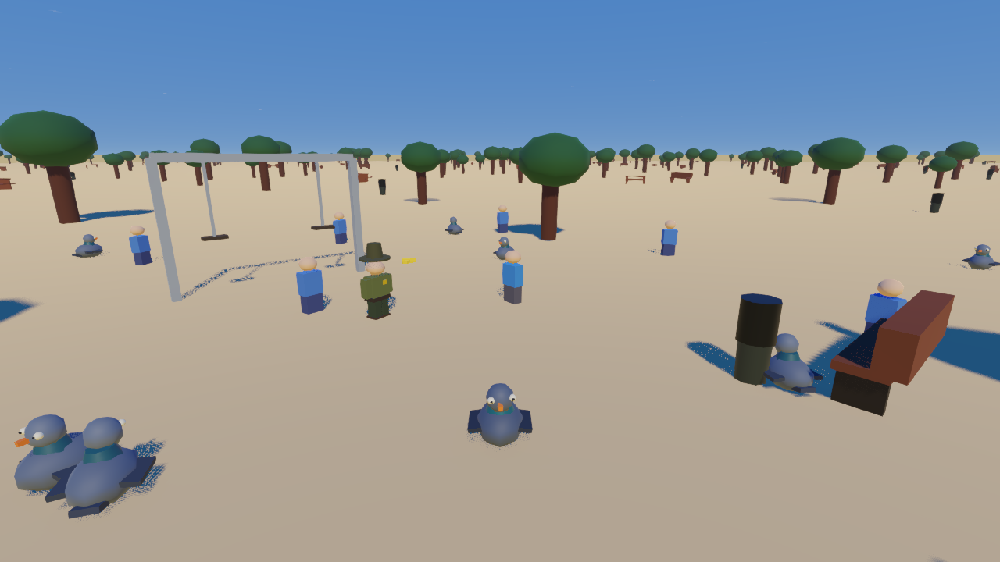
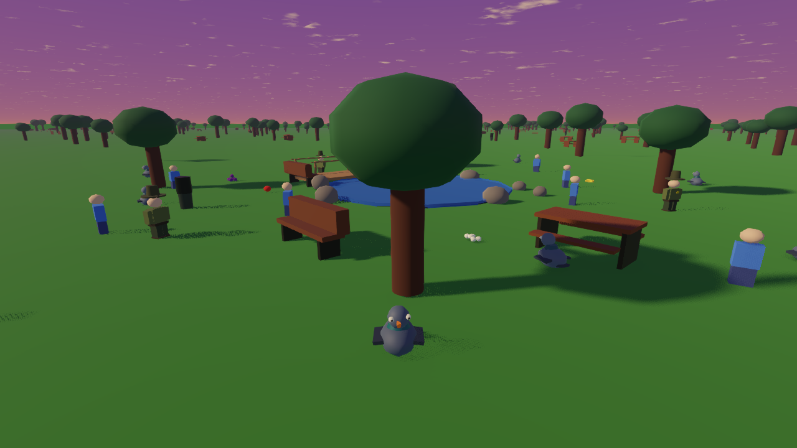
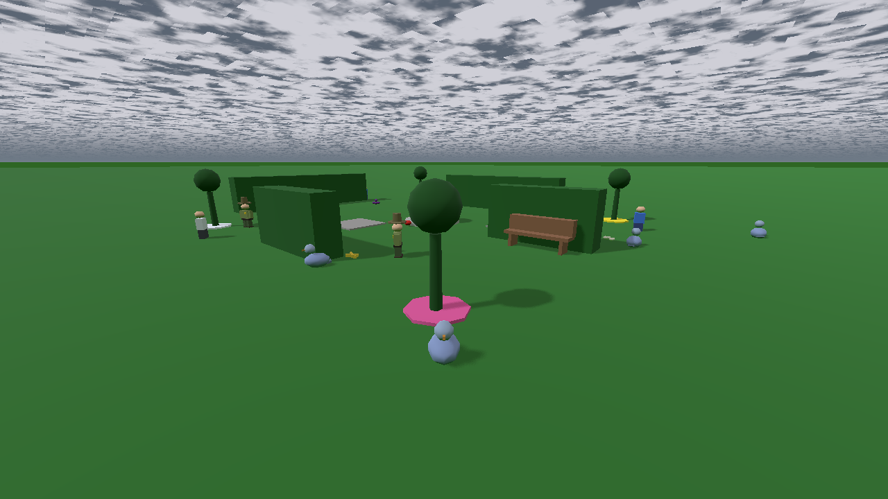

# Don't Look Human

Don't Look Human is a short 3D behavior-stealth game built with Godot 4. You play a suspiciously intelligent pigeon stealing picnic food while trying to move like an ordinary park animal. Sprinting, staring at rangers, walking too directly, standing alone, or lingering in water can expose you.



## Gameplay

Steal every food item, manage ranger suspicion by blending into the flock, and reach the glowing exit before time runs out. The five-level campaign gradually introduces crowds, water hazards, overlapping patrols, denser navigation, and limited cover.

| Level | Theme | Main challenge |
|---|---|---|
| 1. Park | Community park | Learn pecking, blending, and ranger tells |
| 2. Playground | Busy lunch hour | Moving crowds and blocked sightlines |
| 3. Lakeside | Sunset pond | Route choice, exposed food, and slowing water |
| 4. Festival | Weekend event | Long routes through dense, shifting cover |
| 5. Botanical Gardens | Formal hedge garden | Four-ranger coverage with limited pigeon cover |

## Controls

| Keyboard and mouse | Controller | Action |
|---|---|---|
| `WASD` | Left stick | Move |
| `Shift` | Left shoulder | Sprint |
| `E` | A | Peck and collect nearby food |
| Mouse | Right stick | Rotate camera |
| Mouse wheel | D-pad up/down | Zoom |
| `Escape` | Start | Pause or resume |
| `R` | Y | Restart after a result |
| `Space` | A | Start or continue to the next level |
| `H` | Pause menu → Controls | In-game controls reference |
| `F3` | — | Debug-build diagnostics overlay |

## Highlights

- Suspicion reacts to player-like behavior rather than a simple visibility meter.
- Rangers use patrol, investigate, and chase states with level-specific tuning.
- NPC pigeons provide blending cover and react to the closest ranger.
- Five levels share reusable player, HUD, session, ranger, prop, food, water, and escape components.
- Persistent campaign unlocks and per-level best-score presentation.
- Per-level grade thresholds, timers, progression paths, and dynamic collectible counts.
- Full keyboard/mouse and controller gameplay plus menu navigation.
- Frozen result screens with focused next-level, replay, campaign replay, and main-menu actions.
- Dynamic minimap support for arbitrary ranger and collectible counts.
- Procedural ambient audio and sound effects.
- MultiMesh scenery for large prop populations.
- Automated architecture, session, ranger, balance, and reliability validation.

## Running the project

Requirements: Godot 4.7 or a compatible Godot 4 release.

1. Open `project.godot` in Godot.
2. Run the project with the editor's Play button.
3. Select **Play** to start or continue the campaign. **Level Select** replays unlocked maps and shows their best scores.

From PowerShell:

```powershell
Godot_v4.7-stable_win64_console.exe --path .
```

## Validation

Run the permanent validation suite from the project root:

```powershell
Godot_v4.7-stable_win64_console.exe --headless --path . --script res://tests/phase3_level_validation.gd
Godot_v4.7-stable_win64_console.exe --headless --path . --script res://tests/phase4_session_validation.gd
Godot_v4.7-stable_win64_console.exe --headless --path . --script res://tests/phase4_ranger_validation.gd
Godot_v4.7-stable_win64_console.exe --headless --path . --script res://tests/phase5_balance_validation.gd
Godot_v4.7-stable_win64_console.exe --headless --path . --script res://tests/phase6_reliability_validation.gd
Godot_v4.7-stable_win64_console.exe --headless --path . --script res://tests/phase7_release_validation.gd
Godot_v4.7-stable_win64_console.exe --headless --path . --script res://tests/phase8_ux_validation.gd
```

In debug builds, the `F3` overlay shows the current level ID, session state, remaining collectibles, player water state, FPS, and every ranger's state and suspicion. Release exports disable the overlay.

## Screenshots

| Park | Playground |
|---|---|
|  |  |

| Lakeside | Festival |
|---|---|
|  |  |



## Gameplay preview

[Watch or download the 10-second Festival gameplay clip](docs/gameplay_preview.avi). It is captured from the live project and shows ranger suspicion, a food pickup, recovery, crowds, and the minimap.

## Project documentation

- [Architecture summary](docs/architecture.md)
- [Level balance targets](docs/level_balance.md)
- [Known issues and limitations](docs/known_issues.md)
- [Portfolio and release checklist](docs/portfolio_checklist.md)

Windows export settings are included in `export_presets.cfg`. Generated exports and ZIP packages are intentionally ignored by Git.
