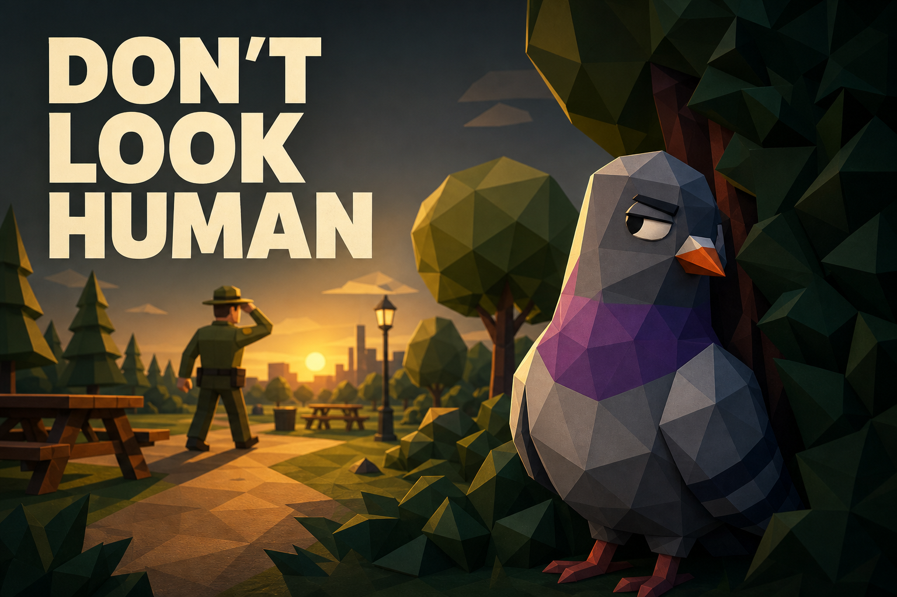

# Don't Look Human

Don't Look Human is a short 3D behavior-stealth game built with Godot 4. You play a suspiciously intelligent pigeon stealing picnic food while trying to move like an ordinary park animal. Sprinting, staring at rangers, walking too directly, standing alone, or lingering in water can expose you.



## Gameplay
https://skipscode.itch.io/dontlookhuman

Steal every food item, manage ranger suspicion by blending into the flock, and reach the glowing exit before time runs out. The five-level campaign gradually introduces crowds, water hazards, overlapping patrols, denser navigation, and limited cover.

| Level | Theme | Main challenge |
|---|---|---|
| 1. Park | Community park | Learn pecking, blending, and ranger tells |
| 2. Playground | Busy lunch hour | Moving crowds and blocked sightlines |
| 3. Lakeside | Sunset pond | Route choice, exposed food, and slowing water |
| 4. Festival | Weekend event | Long routes through dense, shifting cover |
| 5. Botanical Gardens | Formal hedge garden | Four-ranger coverage with limited pigeon cover |

## Controls

| Keyboard and mouse | Controller | Action |
|---|---|---|
| `WASD` | Left stick | Move |
| `Shift` | Left shoulder | Sprint |
| `E` | A | Peck and collect nearby food |
| Mouse | Right stick | Rotate camera |
| Mouse wheel | D-pad up/down | Zoom |
| `Escape` | Start | Pause or resume |
| `R` | Y | Restart after a result |
| `Space` | A | Start or continue to the next level |
| `H` | Pause menu → Controls | In-game controls reference |
| `F3` | — | Debug-build diagnostics overlay |

## Highlights

- Suspicion reacts to player-like behavior rather than a simple visibility meter.
- Rangers use patrol, investigate, and chase states with distinct personalities, readable movement, recoverable misses, and occasional wrong-pigeon grabs.
- NPC pigeons provide blending cover, mimic the player, panic and regroup, and react to nearby rangers and park events.
- Perfect Alibi links an ordinary-looking flock peck to a short, readable theft opportunity without changing the underlying suspicion rules.
- Five authored lighting palettes and themed MultiMesh details give every park its own identity while keeping dense scenes inexpensive.
- Procedural character motion, capture staging, camera feedback, particles, and crowd reactions make success, danger, and failure readable in play and on video.
- A 16-bar adaptive score and five park ambience profiles respond to tension while keeping Music, Ambience, and SFX independently adjustable.
- Five levels share reusable player, HUD, session, ranger, prop, food, water, and escape components.
- Persistent campaign unlocks and per-level best-score presentation.
- Confirmed campaign-and-record reset plus persistent camera sensitivity and inverted-Y settings.
- Per-level grade thresholds, timers, progression paths, and dynamic collectible counts.
- Full keyboard/mouse and controller gameplay plus menu navigation.
- Frozen result screens with focused next-level, replay, campaign replay, and main-menu actions.
- Dynamic minimap support for arbitrary ranger and collectible counts.
- Low, Medium, and High graphics presets plus persistent camera, fullscreen, volume, and reduced-motion settings.
- MultiMesh scenery for large prop populations.
- Automated architecture, gameplay, accessibility, media, performance, packaging, and runtime-error validation.

## Running the project

Requirements: Godot 4.7, or a newer Godot version that you have verified as compatible.

1. Open `project.godot` in Godot.
2. Run the project with the editor's Play button.
3. Select **Play** to start or continue the campaign. **Level Select** replays unlocked maps and shows their best scores.

From PowerShell:

```powershell
Godot_v4.7-stable_win64_console.exe --path .
```

## Validation

Run every permanent validation script with strict runtime-error checking from the project root:

```powershell
.\tools\run_validations.ps1 `
  -GodotPath "C:\path\to\Godot_v4.7-stable_win64_console.exe"
```

In debug builds, the `F3` overlay shows the current level ID, session state, remaining collectibles, player water state, FPS, and every ranger's state and suspicion. Release exports disable the overlay.

## Screenshots

| Park | Playground |
|---|---|
|  |  |

| Lakeside | Festival |
|---|---|
|  |  |


## Release trailer

[Watch or download the 33-second release trailer](docs/gameplay_preview.avi). The hook-first 1280×720 cut opens directly on a theft beside a ranger, escalates through flock blending and a ranger-collision gag, then ends with a four-ranger escape, the "JUST A PIGEON." hook, and an animated wishlist reveal. Gameplay sound is mixed with an original generated trailer score.

## Windows release package

Create a versioned Windows ZIP and SHA-256 checksum from PowerShell:

```powershell
.\tools\package_windows_release.ps1 `
  -GodotPath "C:\path\to\Godot_v4.7-stable_win64_console.exe" `
  -Version "0.9.0" `
  -OutputRoot "export\release-candidate-p6"
```

The script exports the embedded-PCK executable, performs a bounded headless boot smoke test, verifies the ZIP contents, and writes a SHA-256 checksum. It refuses to overwrite an existing target unless an intentional same-version rebuild passes `-Force`; choosing a new `-OutputRoot` is safer. Generated packages remain under the ignored `export/` directory.

## Performance benchmark

Capture a machine-specific, visible-renderer baseline at 1280×720 Medium:

```powershell
.\tools\run_performance_benchmark.ps1 `
  -GodotPath "C:\path\to\Godot_v4.7-stable_win64_console.exe"
```

The committed [baseline](docs/performance/performance_baseline.md) is advisory hardware evidence; runtime errors and deliberately generous structural budgets remain release-blocking.

## Project documentation

- [Architecture summary](docs/architecture.md)
- [Level balance targets](docs/level_balance.md)
- [Known issues and limitations](docs/known_issues.md)
- [Portfolio and release checklist](docs/portfolio_checklist.md)
- [Publishing status](docs/publishing.md)
- [Trailer creative direction](docs/trailer_treatment.md)

Windows export settings are included in `export_presets.cfg`. Generated exports and ZIP packages are intentionally ignored by Git.
